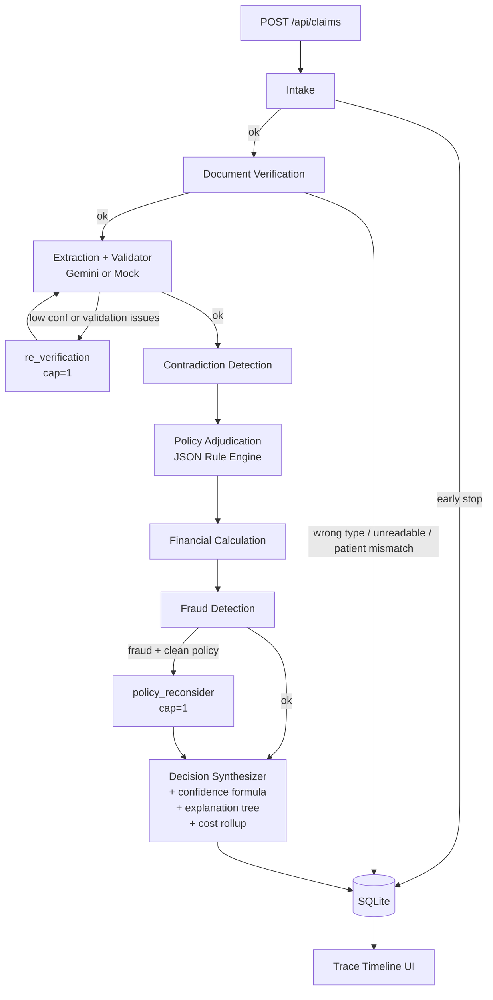

# Architecture

## What this system does

A health insurance claim arrives as a member ID, a category, a treatment date,
a claimed amount, and one or more documents. The system must:

1. Validate the submission and the member.
2. Check that the right documents were uploaded — and tell the member exactly
   what to fix when they weren't.
3. Extract structured data from each document (handwritten Rx, hospital
   bills, lab reports, pharmacy bills) and validate the extraction.
4. Detect cross-document contradictions (patient/date/hospital/amount mismatches).
5. Apply policy rules from a declarative JSON rule engine (coverage,
   exclusions, waiting periods, pre-auth).
6. Calculate the approved amount with a deterministic, auditable order of
   operations.
7. Screen for fraud signals.
8. Deliberate when agents disagree — re-run extraction on low confidence,
   ask policy to reconsider when fraud sees something policy missed.
9. Produce a decision with a formal weighted-confidence number, a causal
   explanation tree, and a complete trace.

Decision statuses include `APPROVED`, `PARTIAL`, `REJECTED`,
`MANUAL_REVIEW`, `NEEDS_REUPLOAD`, `NEEDS_CORRECTION`,
`NEEDS_CLARIFICATION`, `ESCALATED_MEDICAL_REVIEW`, and
`FRAUD_INVESTIGATION` — each routed by the synthesizer based on which
combination of signals the pipeline produced.

## Pipeline (with deliberation cycles)



Concretely the orchestrator is a [LangGraph](https://langchain-ai.github.io/langgraph/)
`StateGraph` over a single `ClaimState` Pydantic object that flows through
every node. Every node:

- reads what it needs from `state`;
- writes its outputs (`extracted`, `findings`, `line_decisions`,
  `fraud_signals`, `decision`) back onto `state`;
- appends one `TraceStep` with status, summary, evidence dict, latency, and
  confidence delta.

This shape is why the trace UI can reconstruct any claim's reasoning without
any logging gymnastics — the trace is the source of truth.

See:
- Wiring: [backend/app/graph/pipeline.py](../backend/app/graph/pipeline.py)
- Models: [backend/app/models/](../backend/app/models)
- Agents: [backend/app/agents/](../backend/app/agents)

## Components and responsibilities

| Component | Responsibility | Critical? |
| --- | --- | --- |
| `IntakeAgent` | Validate member, policy match, minimum claim amount | Yes |
| `DocumentVerificationAgent` | Required-type check, quality check, patient name match | Yes |
| `ExtractionAgent` | Per-document structured extraction via LLM provider; runs the extraction validator and emits per-doc `validation_issues` | No |
| `ContradictionDetectionAgent` | Cross-document checks: patient name, date sanity, hospital name, amount reconciliation, diagnosis-treatment compatibility | No |
| `PolicyAdjudicationAgent` | Thin loop over the JSON rule engine: coverage, exclusions, waiting periods, pre-auth, prescription requirement | No |
| `FinancialCalculationAgent` | Deterministic six-step approved-amount math | No |
| `FraudDetectionAgent` | Same-day / monthly / high-value signals, failure injection | No |
| `re_verification` (deliberation node) | One-shot retry trigger when extraction confidence is low or validator flagged issues; capped at 1 cycle | No |
| `policy_reconsider` (deliberation node) | Routes claim to human review when fraud raised signals but policy passed cleanly; capped at 1 cycle | No |
| `DecisionSynthesizerAgent` | Aggregate findings into `Decision` + user message; build explanation tree; compute final confidence; attach cost rollup | Yes |

Critical agents fail loudly (the orchestrator re-raises). Non-critical
failures are caught by the orchestrator wrapper in `graph/pipeline.py`,
which records the failure on the trace, marks `state.degraded=True`, drops
confidence by 0.25, and continues. This is the mechanism that makes
**TC011** produce an approved decision with a manual-review note instead
of crashing.

## Two LLM providers behind one interface

`LLMProvider` ([backend/app/llm/base.py](../backend/app/llm/base.py)) defines
`extract_document(doc, hint_category) -> (ExtractedDocument, LLMUsage)`.
The usage record carries `tokens_in`, `tokens_out`, `latency_ms`, `model`,
and `usd_estimate` — accumulated onto `state.cost.llm_calls` so the
decision card and the eval report can show "this decision used X tokens
for ≈ $Y in Z ms".

- `GeminiProvider` ([backend/app/llm/gemini.py](../backend/app/llm/gemini.py))
  uses Gemini with a strict JSON schema prompt and a 30-second timeout.
  Vision input is supported when the document carries `bytes_b64` + `mime_type`.
  Pulls real token counts off `response.usage_metadata`.
- `MockProvider` ([backend/app/llm/mock.py](../backend/app/llm/mock.py)) reads
  the pre-extracted `content` block in `test_cases.json`, returns it as an
  `ExtractedDocument`, and emits realistic-but-synthesised usage numbers
  (length-derived) so the eval report carries plausible cost data offline.

The eval suite always uses `MockProvider`, so passing 12/12 is reproducible
without spending tokens. The live demo uses `GeminiProvider` when
`LLM_PROVIDER=gemini` and `GEMINI_API_KEY` are set; otherwise it falls
back to `MockProvider` automatically.

## Declarative rule engine

Policy rules live in `policy_rules.json` at the repo root and are
evaluated by `app.policy.rules.RuleEngine`. We deliberately picked a tiny
custom DSL instead of a general expression language:

- Every operator is a single function in
  [`backend/app/policy/rules.py`](../backend/app/policy/rules.py): `all`,
  `any`, `not`, `equals`, `in`, comparison ops, plus domain operators
  (`matches_diagnosis`, `diagnosis_excluded`, `days_since_join_lt`,
  `category_in`, `claimed_amount_gt`, `high_value_test_in_doc`,
  `category_requires_prescription`, `prescription_present`,
  `category_covered`).
- `${policy.path}` references walk the loaded `policy_terms.json`, so a
  rule like `{"days_since_join_lt": "${policy.waiting_periods.specific_conditions.diabetes}"}`
  picks up policy edits without code changes.
- Rule reasons are templated strings interpolated with the resolved
  values (e.g. `eligibility_date`, `matched_test`) — every fired rule
  produces an auditable, human-readable message tied to the data it saw.
- `inverse_pass` flag flips the polarity for "positive" rules like
  `COVERAGE_CHECK` (the rule fires when coverage is confirmed).

`PolicyAdjudicationAgent` becomes a thin loop: load the engine, evaluate
each rule, convert each `RuleResult` into a `PolicyFinding`. The
synthesizer downstream is unchanged. A reviewer can edit
`policy_rules.json` and re-run `make eval` to see the effect immediately.

## Confidence as a documented formula

Replacing the old ad-hoc `confidence_delta` accumulator,
[`backend/app/decision/confidence.py`](../backend/app/decision/confidence.py)
applies:

```
C_final = clip(Σ wᵢ·Cᵢ − α · contradiction_score − β · degraded_penalty, 0, 1)
```

Weights and penalty coefficients live in `policy_rules.json` so they're
versioned alongside the policy. Each agent fills a structured
`AgentResult` (`confidence`, `evidence_strength`, `contradiction_score`,
`notes`) onto `state.agent_results`; the synthesizer reads them and
applies the formula. The decision card has a "How was this calculated?"
expander that shows each `wᵢ·Cᵢ` term — every value on the final number
is traceable.

The legacy `TraceRecorder.confidence_delta` is preserved on the trace
view (per-step deltas are useful for debugging) but the authoritative
number on `Decision.confidence` is now the formula.

## Decision Explanation Tree

The synthesizer also builds a recursive
[`DecisionNode`](../backend/app/models/explanation.py) tree showing the
causal structure of the decision:

```
APPROVED ₹3,240
├── Policy checks
│   ├── COVERAGE_CHECK [PASS]
│   └── WAITING_PERIOD_DIABETES [PASS]
├── Cross-document contradictions  (empty when none)
├── Financial calculation
│   ├── Claimed amount ₹4,500
│   ├── −20% network discount (Apollo) → ₹3,600
│   └── −10% co-pay → ₹3,240
└── Fraud signals  (empty when none)
```

The frontend's [`DecisionTree`](../frontend/components/DecisionTree.tsx)
component renders this with collapse/expand and per-node evidence pop-outs
so reviewers can click into any node to see the source-document snippet
that justified the rule.

## Financial calculation order

The single most error-prone part of any claims pipeline is the order of
operations. We pin it in one place
([backend/app/policy/coverage.py](../backend/app/policy/coverage.py))
and unit-test it explicitly:

1. **Line-item exclusion filter** — drop excluded items (TC006: teeth whitening).
2. **Per-claim ceiling** — reject if `gross_after_line_items > max(per_claim_limit, sub_limit)` (TC008).
3. **Network discount** — apply category `network_discount_percent` if hospital is in `network_hospitals` (TC010).
4. **Co-pay** — apply on the post-discount amount.
5. **YTD cap** — cap at `annual_opd_limit - ytd_claims_amount`.

Sub-limit is treated as an informational warning, not a hard cap (TC010
expects ₹3,240 which exceeds the consultation sub-limit of ₹2,000).

## Trace as a first-class object

Every `TraceStep` carries:

- `step` (agent name)
- `status` (OK / WARNING / ERROR / SKIPPED / EARLY_STOP)
- `summary` (one human sentence)
- `evidence` (structured: matched rule, calculated breakdown, file IDs)
- `confidence_delta` (signed)
- `latency_ms`
- `error` (typed error code if any)

The frontend ([frontend/components/TraceTimeline.tsx](../frontend/components/TraceTimeline.tsx))
renders this directly. Reviewers click any step to see the JSON evidence —
this is the audit answer to "why did this claim get this decision?"

## Specific, actionable error messages

The hardest part of TC001–TC003 isn't detection — it's the message. We hold
ourselves to "no generic errors" by routing every typed error through
`error_to_user_message` ([backend/app/models/errors.py](../backend/app/models/errors.py)),
which interpolates the data the assignment requires:

- `DocumentTypeMismatchError` → names the uploaded type, the required type,
  and the missing types.
- `UnreadableDocumentError` → names the specific `file_id` that must be reuploaded.
- `PatientMismatchError` → names every patient name found and which file
  each came from.

## Storage

SQLite via SQLAlchemy async with a JSON column for the full `ClaimState`.
The repository layer is unchanged for Postgres — only `DATABASE_URL`
changes. We persist the full state JSON (not just the decision) so the
trace UI can render any historical claim from the database alone.

## What we considered and rejected

- **CrewAI / Autogen for orchestration** — heavier, slower iteration,
  agents that talk to each other don't help us here. LangGraph's typed
  state and per-node interception are the right primitives for this
  problem.
- **Separate OCR step before extraction** — Gemini's vision is good
  enough that adding a dedicated OCR pre-step buys us little but
  doubles the failure modes. Trade-off: handwritten Rx accuracy. We'd
  add a dedicated OCR + retry layer at 10x scale (see below).
- **Postgres for the demo** — overkill in 2 days. The repository layer
  is identical against Postgres; only the URL changes.
- **Background workers / queues** — premature for the demo. Documented
  as the explicit 10x scaling change.
- **Real auth and multi-tenancy** — not in scope for the assignment.
  The policy loader caches a single policy; multi-tenancy adds a
  policy ID parameter to every load call.

## Limitations of the current design

1. **Single policy file** in memory; no per-tenant separation.
2. **Pre-auth is detected, not looked up**. Real ops would query a
   pre-auth records DB. We treat the absence of a pre-auth as a
   missing pre-auth, which is correct for the test cases but pessimistic
   in production.
3. **Doctor registration** isn't validated against any external source.
   Real fraud screening would call an MCI or state council API and
   cache results.
4. **Same-document deduplication** is not implemented. Two near-identical
   bills uploaded on different days would not be linked.
5. **Synchronous request handling** — the API blocks on the pipeline.
   For human-uploaded claims this is fine (sub-2s with mock provider,
   ~5s with Gemini). For automated bulk processing we'd queue.

## How this scales to 10x (and to 75k → 10M claims)

| Concern | Now | At 10x | At 100x |
| --- | --- | --- | --- |
| **Sync vs queue** | Single request handler | Queue (Redis Streams or SQS); pipeline runs in workers; UI polls a job ID | Multiple priority queues (real-time vs bulk); back-pressure |
| **Storage** | SQLite | Postgres + read replicas | Postgres for state, S3 for raw documents, Snowflake/BigQuery for analytics |
| **LLM cost** | Per-call to Gemini | Add a vector cache keyed on document hash; reuse extractions on resubmits | Distil a small extraction model fine-tuned on Indian medical docs; fall back to Gemini only on low confidence |
| **Trace volume** | JSON column | Move trace to a structured table partitioned by date | Move trace to OpenTelemetry; sample evidence; keep summaries hot |
| **Policy** | Single JSON | Per-tenant JSON loaded by `policy_id` | Versioned policies in DB with schema validation; rule registry |
| **Observability** | Trace recorder + structlog | Add Prometheus metrics on per-agent latency, failure rate, confidence distribution | SLOs per agent; alerting on confidence drift; per-tenant dashboards |
| **Failure budgets** | Per-agent try/except | Circuit breakers around LLM calls; retry with backoff | Per-tenant rate limits; cost ceilings before cutoff |
| **Auth** | None | OIDC at the edge | Per-tenant signing keys; ops scoped to tenants by RBAC |
| **Doc storage** | In request body | Upload to S3 first, pipeline reads pre-signed URLs | Same, plus DLP and PII redaction in flight |
| **Drift detection** | Manual eval suite | Eval on every PR + golden-set replay nightly | Live A/B comparing rules engine vs LLM-only baseline; weekly model evals |

The agent-graph shape doesn't change at any of these scales — only the
runtime around it does.

## Out-of-scope but production-ready

These are documented (not implemented) because each requires external
data, infra investment, or a meaningful runtime change. The current code
is shaped to drop them in without rewriting agents.

### Async / event-driven processing

For high volume, swap the synchronous `POST /api/claims` for an enqueue
endpoint that pushes the claim onto a queue (Redis Streams, SQS, or a
database-backed queue like pgmq), with worker processes pulling from
the queue and running the same `run_pipeline` function. The trace,
state, and decision shape don't change — only when they're computed.
Worker types: an extraction worker (LLM-bound), a deterministic worker
(policy/finance/fraud, CPU-bound), and a synthesis worker. We'd add
priority queues to keep human-uploaded claims sub-second while bulk
batch jobs run on cheaper compute.

### Policy RAG over PDF policies

The current policy is structured JSON which keeps the rule engine
auditable. When policy lives in long PDFs (typical for B2B contracts):
chunk by section heading, embed with a sentence-transformer model,
store in a vector DB (pgvector or Qdrant), and retrieve top-K chunks
by query at rule-evaluation time. The retrieved chunks become evidence
on each `RuleResult.evidence_links`. The hard part is keeping the
extracted rules numerically consistent with the source PDF — we'd
ship a "policy diff" view that shows extracted rules vs source page so
ops can validate before activation.

### ICD-10 / CPT validation

The contradiction agent's `DIAGNOSIS_TREATMENT_MISMATCH` check uses a
hand-curated allowlist suitable for the 12 fixture cases. Production
would integrate ICD-10 (diagnosis) and CPT/HCPCS (procedure) datasets,
with a join table mapping diagnosis codes to plausibly-related procedure
codes. Free datasets exist (CMS, NHS Digital). The integration shape:
extraction agent maps free-text diagnosis to ICD-10 (LLM with a strict
schema), contradiction agent looks up the plausible procedure set, and
flags a mismatch on no overlap.

### Temporal / geographic fraud

The fraud agent has same-day, monthly, and high-value signals. Production
fraud screening adds: hospital-switching velocity (same patient at 3
different hospitals in 1 month), geo-anomaly (claim 1000km from home
address), provider-collusion clusters (statistically improbable shared
patient lists across providers). All require historical claims data
and a feature store; the shape of the agent stays identical.

## Why multi-agent (vs one big LLM call)

The bonus on the rubric calls this out explicitly. The reasons we agree:

1. **Auditable handoffs.** Each agent has a typed input and output. A reviewer
   can read off exactly which step changed which value.
2. **Selective resilience.** Document verification must abort the pipeline
   (TC001–TC003). Fraud detection must not (TC011). Encoding that as
   `is_critical` per agent is trivial here, intractable in a monolithic chain.
3. **Cheap to extend live.** The technical review explicitly tests live
   extension. Adding a new rule (e.g. teleconsultation cap) is one new
   pure function in `app.policy` plus one new finding in
   `PolicyAdjudicationAgent` — no rewiring.
4. **LLM use is bounded.** Only the extraction agent calls the LLM. Policy,
   math, and fraud are deterministic Python with unit tests.
